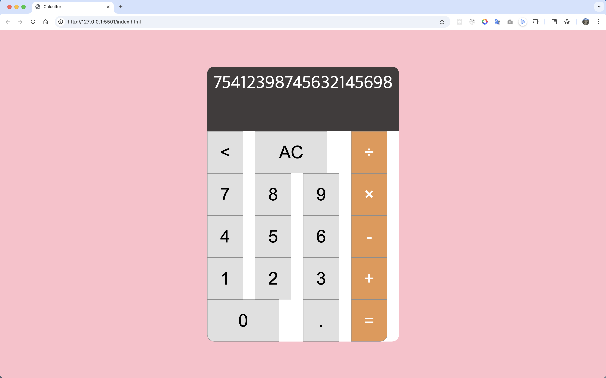

# 🧮 계산기

- 계산기 페어 프로그래밍
  - 조보근
  - 백하연
- 기간 : 2025.09.24 ~ 2025.09.29

### 구현하지 못한 부분들

- `Shift` 키와 `+` 키를 입력해 `+` 연산 처리
- `Shift` 키와 `*` 키를 입력해 `*` 연산 처리
- 소수점 구현
- 키보드에서 `-` 누르면 계속해서 입력되고 줄바꿈이 됨.
- NaN 에러 처리
- 2 . 만 누르고 + 를 누르면 2.0이 되게 처리
- 입력값이 길어지면 폰트 사이즈가 줄어들도록 처리 필요
- 수식 표시에 숫자 단위(`,`) 표시

## 💡 고민했던 내용들

1. HTML5 시맨틱 요소 활용
2. CSS 속성 작성 순서
3. 스택(Stack)을 활용한 기능 구현

## 💣 트러블 슈팅

> 구현 과정에서 만난 이슈들

1.  `Uncaught TypeError: Cannot set properties of null (setting 'textContent')` 발생

    ```html
    <head>
      <script src="index.js"></script>
    </head>
    <body>
      <!-- 생략 -->
    </body>
    ```

    - HTML은 위에서 아래로 파싱됨.
    - `<head>` 내부에서 스크립트를 불러오면, 아직 DOM이 생성되기 전이라 요소를 찾지 못해 에러 발생.
    - `<script>`를 만나면 HTML 파싱이 잠시 멈추고 자바스크립트를 해석하기 때문에 `<head>` 끝부분에 위치시켜도 파싱 속도가 늦어져 페이지 로딩이 지연될 수 있음.

    ✅ **해결 방법**

    1. `<script>`를 `</body>` 바로 위에 배치.
    2. `<script defer>` 속성을 사용해 HTML 파싱 완료 후 실행되도록 설정.

    ➡️ 2번 해결 방법처럼 defer 속성을 추가해 해결.

2.  입력값 길이로 인해 계산기 width 깨짐
    
    - 긴 입력값이 표시 영역을 넘어가면서 레이아웃이 깨짐.
    - CSS에서 `overflow`, `text-overflow`, `word-break` 등을 설정해 해결.

## 회고
> 팀 멘토링 코드 리뷰 후 작성 예정.
